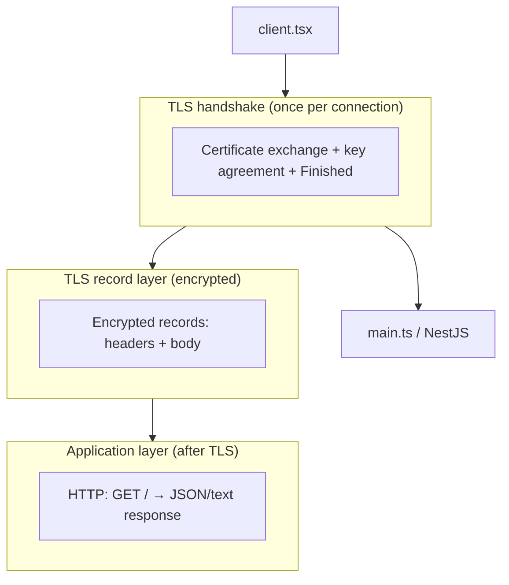
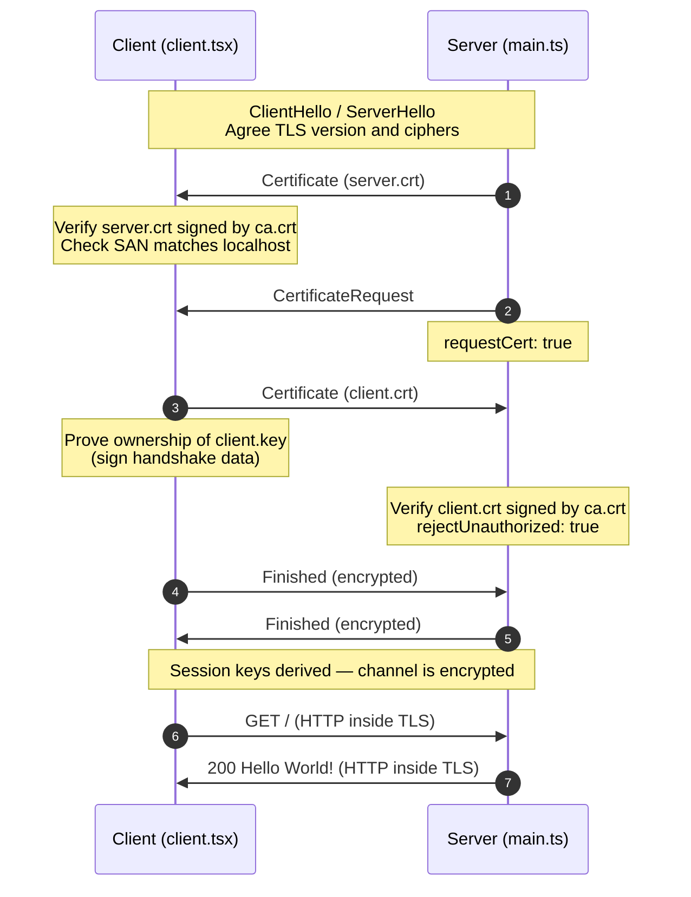
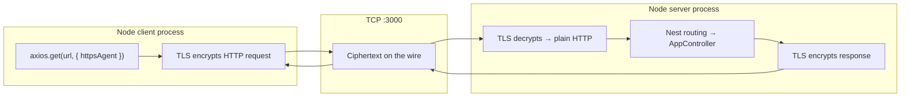

# mTLS Sample — NestJS Server + Node Client

A minimal **mutual TLS (mTLS)** demo: a NestJS HTTPS server that requires a client certificate, and a Node.js client that presents one. Both sides trust the same local Certificate Authority (CA).

## What is mTLS?

| | Normal HTTPS | mTLS |
|---|--------------|------|
| Server proves identity | Yes | Yes |
| Client proves identity | No (password/cookie/API key later) | **Yes (certificate)** |
| Anonymous clients | Allowed | **Rejected** (with this config) |

TLS encrypts traffic and authenticates the **server**. mTLS adds authentication of the **client** during the TLS handshake, before HTTP runs.

## Trust model (this project)

All certificates are issued by a **local dev CA** you create with OpenSSL scripts in `certs/`.

```
                    ca.crt  (+ ca.key — keep private)
                   "Local Dev CA"
                          |
          +---------------+---------------+
          |                               |
    server.crt                        client.crt
    CN=localhost                      CN=my-client
    EKU: serverAuth                   EKU: clientAuth
    SAN: localhost, 127.0.0.1
          |                               |
    server.key                        client.key
    (private)                         (private)
```

- **`ca.crt`** — trust anchor. Both server and client load it to decide which peers they accept.
- **`server.crt` + `server.key`** — server identity (TLS server role).
- **`client.crt` + `client.key`** — client identity (TLS client role).

Private keys never leave the machine; the handshake only proves possession of the key.

## Project layout

```
mtls_server/
├── certs/                 # PKI assets (generated locally, gitignored)
│   ├── ca.ps1             # Create CA
│   ├── server.ps1         # Server cert + SAN
│   ├── client.ps1         # Client cert + clientAuth
│   ├── ca.crt / ca.key
│   ├── server.crt / server.key
│   └── client.crt / client.key
├── src/
│   ├── main.ts            # Nest HTTPS + mTLS options
│   └── client/
│       └── client.tsx     # axios + https.Agent (mTLS client)
└── package.json
```

## How mTLS exchanges data (overview)



1. **Handshake** — negotiate TLS version/ciphers; exchange and verify certificates; derive session keys.
2. **Record layer** — all HTTP bytes are encrypted/authenticated inside TLS records.
3. **HTTP** — Nest sees a normal `IncomingMessage`; TLS is already done in Node's `https` server.

## TLS handshake (detailed sequence)

This is what happens when you run `pnpm run client` against `pnpm run start`:



If any verification step fails, Node aborts the connection — your Nest controller never runs.

## What each side configures

### Server (`src/main.ts`)

```typescript
httpsOptions: {
  key: server.key,
  cert: server.crt,
  ca: ca.crt,                    // which client CAs to trust
  requestCert: true,             // ask client for a certificate
  rejectUnauthorized: true,      // reject if client cert invalid/missing
}
```

| Option | Effect |
|--------|--------|
| `key` / `cert` | Server presents its identity to clients |
| `ca` | Only client certs signed by this CA are accepted |
| `requestCert` | Enables mutual TLS (client must send a cert) |
| `rejectUnauthorized` | Do not allow connections without a valid client cert |

### Client (`src/client/client.tsx`)

```typescript
new https.Agent({
  ca: ca.crt,                    // trust server certs from this CA
  cert: client.crt,              // client identity
  key: client.key,
  rejectUnauthorized: true,      // reject if server cert invalid
})
```

| Field | Effect |
|-------|--------|
| `ca` | Trust server only if `server.crt` chains to this CA |
| `cert` / `key` | Present client identity when server requests it |
| `rejectUnauthorized` | Fail if server cert is wrong/expired/wrong host |

## Certificate generation

Certificate files (`*.crt`, `*.key`, etc.) are listed in `.gitignore`. Generate them locally before running the app.

From `certs/` (requires OpenSSL; PowerShell scripts set `OPENSSL_CONF` for Anaconda/Git OpenSSL on Windows):

```powershell
cd certs
.\ca.ps1       # ca.key, ca.crt (10-year self-signed CA)
.\server.ps1   # server.key, server.crt (SAN: localhost, 127.0.0.1)
.\client.ps1   # client.key, client.crt (EKU: clientAuth)
```

**Extensions matter:**

- **Server** — `subjectAltName` so `https://localhost` validates; `extendedKeyUsage=serverAuth`.
- **Client** — `extendedKeyUsage=clientAuth` so the cert is valid for client authentication.

## Running the demo

This project uses **pnpm** (`pnpm-lock.yaml`).

```powershell
# From project root (mtls_server/)
pnpm install

# If pnpm reports ERR_PNPM_IGNORED_BUILDS, approve builds first:
#   pnpm approve-builds --all
# Then set allowBuilds in pnpm-workspace.yaml to true for @nestjs/core, esbuild, unrs-resolver

pnpm run start          # Terminal 1 — HTTPS on :3000

pnpm run client         # Terminal 2 — mTLS GET https://localhost:3000
```

Expected client output: `Hello World!` (or your controller response).

## What fails without mTLS pieces

| Scenario | Result |
|----------|--------|
| Browser / curl without client cert | TLS handshake fails (server requires cert) |
| Client without `ca.crt` matching server | Client rejects server |
| Client with random cert (not signed by `ca.crt`) | Server rejects client |
| `rejectUnauthorized: false` | May connect but **skips verification** — not secure |

## Data flow after the handshake (one HTTP request)



- **On the wire:** only encrypted TLS records (certificates are sent during the handshake; application data is encrypted afterward).
- **In Nest:** `req` / `res` look like normal HTTP; certificate details are available on `req.socket` if you want to read the client CN later.

## Optional: reading the client identity in Nest

TLS verification happens in Node before Nest. To use the client name in app logic:

```typescript
const cert = req.socket.getPeerCertificate();
// cert.subject.CN → e.g. "my-client"
```

This sample does not implement that guard yet — any cert signed by your CA is accepted.

## Security notes (local dev only)

- **`ca.key`** is highly sensitive; do not commit or share it.
- This CA is **not** in browsers' trust stores — only your client uses it via `ca: fs.readFileSync('ca.crt')`.
- Certificates here are for **learning**; use proper PKI/HSM/processes in production.
- Rotating certs: re-run the `.ps1` scripts and restart server/client.

## Scripts reference

| Script | Command |
|--------|---------|
| Start server | `pnpm run start` |
| Start server (watch) | `pnpm run start:dev` |
| Run mTLS client | `pnpm run client` |
| Build | `pnpm run build` |

## Dependencies

- **Server:** NestJS with Node `https` options passed to `NestFactory.create`.
- **Client:** `axios` + Node `https.Agent`.
- **Client runner:** `tsx` (`pnpm run client`).

## Troubleshooting

| Problem | Check |
|---------|--------|
| `ENOENT` on cert paths | Generate certs in `certs/`; run server from project root (`process.cwd()/certs`) |
| `UNABLE_TO_VERIFY_LEAF_SIGNATURE` | Client `ca` must be your `ca.crt` |
| `alert bad certificate` / handshake failure | Client must send `client.crt` + `client.key`; server needs `requestCert: true` |
| Hostname mismatch | Use `https://localhost` and ensure `server.crt` SAN includes it |
| `pnpm run build` fails on install | Run `pnpm approve-builds`; set `allowBuilds` to `true` in `pnpm-workspace.yaml` for packages with install scripts |
| OpenSSL `openssl.cnf` not found (Windows) | Scripts in `certs/*.ps1` set `OPENSSL_CONF` automatically |

## Further reading

- [Node.js TLS documentation](https://nodejs.org/api/tls.html)
- [RFC 8446 — TLS 1.3](https://datatracker.ietf.org/doc/html/rfc8446)
- [NestJS FAQ — HTTP adapter](https://docs.nestjs.com/faq/http-adapter)

## License

UNLICENSED (private sample project).
